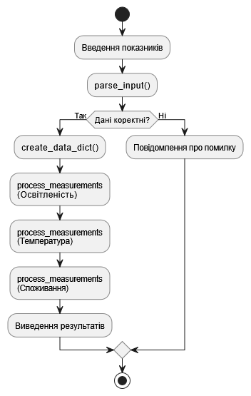
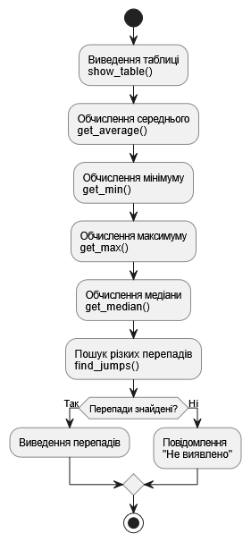

# Бай Володимир, ІКМ-224а

# Звіт з лабораторної роботи №2
# з курсу "Мультипарадигмальні мови програмування"

# Процедурна парадигма. Використання підпрограм, модулів та пакетів у мові Python

## Варіант №1 «Розумний офіс»

## Мета роботи
Ознайомитися зі способами створення та використання підпрограм, модулів і пакетів у Python. Навчитися структурувати програму шляхом поділу її на функціональні частини та модулі. Закріпити вміння застосовувати стандартні модулі мови (наприклад, `statistics`).
Засвоїти принципи процедурної парадигми програмування шляхом використання відповідних можливостей мови Python, формуючи навички побудови програм у стилі послідовного виконання інструкцій та виклику підпрограм.

## Опис програми

Основна програма lab02_main.py виконує такі кроки:

1. **Імпортує модуль stats_module.py:**

   Модуль stats_module.py містить наступні функції:
     - get_average(data_dict) повертає середнє значення
     - get_min(data_dict) повертає мінімальне значення
     - get_max(data_dict) повертає максимальне значення
     - get_median(data_dict) повертає медіану
     - find_jumps(data_dict, threshold) знаходить різкі перепади між сусідніми значеннями. Повертає список рядків із вказаними мітками часу та різницею
     - how_table(data_dict, title) виводить таблицю значень
   
   Перед усіма функціями імпортується модуль statistics

2. **Здійснює введення трьох рядків даних від користувача:**
   - Освітленість
   - Температура
   - Споживання

   За умовою завдання немає обмежень на кількість введених даних за кожним показником. Єдиним обмеженням є тільки те, що вони повинні бути числами.

   Функція parse_input(input_str) обробляє введені користувачем числові дані показників;
   дані передаються єдиним рядком, розділяються, перевіряються та перетворюються на дійсні числа.
  
   Програма повертає список числових значень, якщо значення перетворити на числа неможливо - видається повідомлення про помилку.

3. **Формує словник data згідно із заданою структурою:**

    На основі списків з показниками освітленості, температури та споживання формується словник зі словників.
    Мітки часу задаються без конкретних значень (Т1, Т2, ...).
    
    Функція create_data_dict(lum_list, temp_list, cons_list) повертає створений словник зі словників освітленості, температури та споживання.

4. **Обчислює статистику на основі кожного із словників:**

    Функція process_measurements(title, data_dict, threshold) є універсальною для освітлення, температури, споживання, або будь-якого іншого показника.
    В параметрах передаються назва показника, словник з його значеннями, порогове значення для визначення різких перепадів.
    Функція process_measurements(title, data_dict, threshold) викликає функції з підключеного модуля stats_module.py та виконує наступні дії:
     - виводить на екран відформатовану таблицю значень відповідного параметра
     - обчислює та виводить основні статистичні параметри для переданого у аргументах показника:
       - середнє значення
       - мінімальне значення
       - максимальне значення
       - медіану
     - виконує пошук різких перепадів і виводить інформацію про них, якщо такі були знайдені.

## Розділення коду на файли:
Структура каталогів та файлів проєкту має вигляд:

```bash
📁Lab2/
│
├── 📁Task1_Modules/
│   ├── 📝lab02_main.py
│   └── 📝stats_module.py
│
└── 📁Task2_Package/
    ├── 📝lab02_main.py
    └── 📁sensors/
        ├── 📝__init__.py
        └── 📝stats_module.py

```

У каталозі `Task1_Modules` розміщена реалізація **Завдання №1** з використанням звичайного модуля Python. Основна програма `lab02_main.py` відповідає за введення та обробку даних користувача, а модуль `stats_module.py` містить набір підпрограм для статистичної обробки показників.

У каталозі `Task2_Package` розміщена реалізація **Завдання №2** з використанням пакета Python. Для цього створено пакет `sensors`, який містить файл `stats_module.py` із реалізацією статистичних функцій та файл `__init__.py`, що забезпечує зручний імпорт функцій пакета.

Винесення функцій в окремі модулі та пакети дозволяє:
- уникнути дублювання коду;
- покращити читабельність програми;
- забезпечити повторне використання функцій;
- спростити супровід та модифікацію програмного забезпечення.

## Приклад результату роботи програми

```css
=== Обробка показів системи 'Розумний офіс' ===
Введіть освітленість (лк): 450 500 1600 550 480
Введіть температуру (°C): 21.5 22.0 28.5 23.0 22.2
Введіть споживання (Вт): 150 160 400 180 170

=== Таблиця показів: Освітленість ===
Мітка часу | Значення
T1           450.0
T2           500.0
T3           1600.0
T4           550.0
T5           480.0

Середнє: 716.00
Мінімум: 450.0
Максимум: 1600.0
Медіана: 500.0
Різкі перепади:
  T2 → T3 (1100.00)
  T3 → T4 (1050.00)

=== Таблиця показів: Температура ===
Мітка часу | Значення
T1           21.5
T2           22.0
T3           28.5
T4           23.0
T5           22.2

Середнє: 23.44
Мінімум: 21.5
Максимум: 28.5
Медіана: 22.2
Різкі перепади:
  T2 → T3 (6.50)
  T3 → T4 (5.50)

=== Таблиця показів: Споживання ===
Мітка часу | Значення
T1           150.0
T2           160.0
T3           400.0
T4           180.0
T5           170.0

Середнє: 212.00
Мінімум: 150.0
Максимум: 400.0
Медіана: 170.0
Різкі перепади:
  T2 → T3 (240.00)
  T3 → T4 (220.00)
```

## Алгоритм програми

Блок-схема основної програми



Блок-схема функції process_measurements



## Посилання на код програми на Github

https://github.com/vladimirbai08/MPMP/Lab2

## Приклади тестування
- Тестування на коректних даних з різною кількістю показів

```css
=== Обробка показів системи 'Розумний офіс' ===
Введіть освітленість (лк): 450
Введіть температуру (°C): 20 21 22.5
Введіть споживання (Вт): 160 400

=== Таблиця показів: Освітленість ===
Мітка часу | Значення
T1           450.0

Середнє: 450.00
Мінімум: 450.0
Максимум: 450.0
Медіана: 450.0
Різкі перепади: не виявлено

=== Таблиця показів: Температура ===
Мітка часу | Значення
T1           20.0
T2           21.0
T3           22.5

Середнє: 21.17
Мінімум: 20.0
Максимум: 22.5
Медіана: 21.0
Різкі перепади: не виявлено

=== Таблиця показів: Споживання ===
Мітка часу | Значення
T1           160.0
T2           400.0

Середнє: 280.00
Мінімум: 160.0
Максимум: 400.0
Медіана: 280.0
Різкі перепади:
  T1 → T2 (240.00)
```

- Тестування на некоректних даних

```css
=== Обробка показів системи 'Розумний офіс' ===
Введіть освітленість (лк): 450
Введіть температуру (°C): 20 21 22.5
Введіть споживання (Вт): Л
Помилка: введіть лише числа!
```

```css
=== Обробка показів системи 'Розумний офіс' ===
Введіть освітленість (лк): 450
Введіть температуру (°C): 20 21 22,5
Введіть споживання (Вт): 160
Помилка: введіть лише числа!
```

```css
=== Обробка показів системи 'Розумний офіс' ===
Введіть освітленість (лк): 450:00
Введіть температуру (°C): 20 21 22.5
Введіть споживання (Вт): 150 160
Помилка: введіть лише числа!
```

## Висновки

У ході виконання лабораторної роботи було освоєно створення та використання підпрограм, модулів і пакетів у мові Python. Програма була структурована відповідно до принципів процедурної парадигми програмування шляхом розділення функціональності між основною програмою та окремими модулями.

Таке розділення дозволило продемонструвати використання окремих модулів Python, пакетів Python, структурної організації програмного коду, процедурної парадигми програмування.

Також було закріплено навички роботи зі словниками, функціями та стандартними модулями Python для статистичної обробки даних.