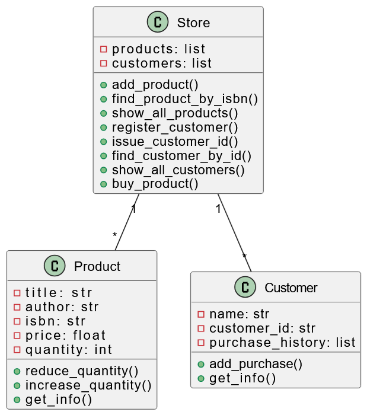

# Бай Володимир, ІКМ-224а

# Звіт з лабораторної роботи №3
# з курсу "Мультипарадигмальні мови програмування"

# Використання об'єктно-орієнтованої парадигми програмування для створення прикладних програм

## Варіант №1 «Модель книжкового магазину»

## Мета роботи
Закріпити знання базових принципів об’єктно-орієнтованого програмування: створення класів та об’єктів, інкапсуляцію, наслідування, поліморфізм. Навчитися моделювати предметну область у вигляді взаємопов’язаних класів.
Засвоїти принципи парадигми об’єктно-орієнтованого програмування шляхом реалізації простої інформаційної системи, використовуючи ООП.

## Основне завдання
Виконати реалізацію простої інформаційної системи, використовуючи можливості об'єктно-орієнтованого програмування в мові Python.
Розглянути реалізацію зразкового варіанту завдання. Виконати розв'язання індивідуального варіанту, використовуючи знання про парадигму ООП та навички, отримані при аналізі зразкового варіанту. За результатами виконання завдання оформити звіт та прикріпити його до завдання у навчальній системі.

Універсальні вимоги для всіх варіантів - кожне завдання повинно містити:

- мінімум 3 класи ("каталог", "елемент/продукт", "користувач");
- асоціацію між об’єктами (об'єкти мають взаємодіяти);
- статус об’єкта (активний/зайнятий/доступний);
- пошук за ключовим полем;
- консольне меню;
- збереження в CSV та JSON;
- обробку помилок.

## Варіант 1. Модель книжкового магазину

    Класи: `Product`, `Customer`, `Store`
    Функції: додавання товарів, оформлення покупки, облік залишків, історія покупок.
    Збереження: товари — CSV, клієнти — JSON.

## Завдання

Необхідно розробити програму, що моделює роботу книжкого магазину.
Система повинна дозволяти:

- додавати товари до магазину;
- реєструвати клієнтів;
- здійснювати пошук товарів;
- продавати товари клієнтам (оформлення покупки);
- переглядати списки товарів і клієнтів;
- здійснювати облік залишків;
- виводити історію покупок клієнта.

Програма має бути реалізована з використанням принципів об’єктно-орієнтованого програмування. Функціонал буде реалізовано через командне меню у консолі.

Функціональні вимоги:

- програма повинна забороняти продаж товарів, якщо в магазині немає достатньої кількості.
- програма повинна перевіряти існування клієнта перед продажем.
- програма повинна обробляти ситуацію, коли товар не знайдено.
- програма повинна коректно змінювати статус товару при покупці.

Обов’язкові вимоги до реалізації:

- використання класів та об’єктів.
- інкапсуляція (атрибути не повинні змінюватися напряму ззовні без потреби).
- код має бути структурований.
- наявність демонстраційного сценарію роботи.
- обробка помилок (через умовні конструкції або винятки).

## Розробка та реалізація програми

### Структура класів

#### 1. Клас Product

Атрибути:

- `title` — назва товару
- `author` — автор товару (книги)
- `isbn` — унікальний ідентифікатор
- `price` — ціна товару
- `quantity` — кількість товарів із заданим ISBN в магазині

Методи:

- зменшення кількості товарів (книг із заданим ISBN);
- збільшення кількості товарів (книг із заданим ISBN);
- відображення повної інформації про товар (книгу, що має заданий ISBN) — назва, автор, ціна, кількість;
- (додатково) перевизначення __str__().

#### 2. Клас Customer

Атрибути:

- `name` — ПІБ клієнта
- `customer_id` — унікальний номер клієнта
- `purchase_history` — історія покупок

Методи:

- конструктор;
- метод додавання товару до історії покупок;
- метод виведення інформації про клієнта (ID, історія покупок);
- (додатково) перевизначення __str__().

#### 3. Клас Store

Атрибути:

- `products` — список товарів магазину;
- `customers` — список клієнтів магазину.

Методи:

- `add_product(product)` — додавання товару (книги);
- `find_product_by_isbn(isbn)` — пошук товару за ISBN;
- `show_all_products()` — перегляд усіх товарів;
- `register_customer(customer)` — реєстрація клієнта;
- `find_customer_by_id(customer_id)` — пошук клієнта за ID;
- `show_all_customer()` — перегляд усіх клієнтів;
- `buy_product(isbn, customer_id, amount)` — оформлення покупки;

### Інтерфейс користувача

Інтерфейс користувача реалізувано у вигляді консольного меню:

1. Додати товар
2. Зареєструвати клієнта
3. Купити книгу
4. Показати всі товари
5. Показати всіх клієнтів
6. Зберегти дані
7. Вийти

Програма працюватиме у нескінченному циклі доки не буде обраний пункт «Вийти».

### UML-діаграма класів

Текстове представлення (спрощена нотація UML)

```cmd
+------------------------+
|         Product        |
+------------------------+
| - title: str           |
| - author: str          |
| - isbn: str            |
| - price: float         |
| - quantity: int        |
+------------------------+
| + __init__()           |
| + reduce_quantity():   |
| + increase_quantity(): |
| + get_info(): str      |
| + __str__(): str       |
+------------------------+

+--------------------------+
|         Customer         |
+--------------------------+
| - name: str              |
| - customer_id: int       |
| - purchase_history: list |
+--------------------------+
| + __init__()             |
| + add_purchase():        |
| + get_info(): str        |
| + __str__(): str         |
+--------------------------+

+------------------------------+
|            Store             |
+------------------------------+
| - products: list[Product]    |
| - customers: list[Customer]  |
+------------------------------+
| + add_product():             |
| + find_product_by_isbn():    |
| + show_all_products():       |
| + register_customer():       |
| + issue_customer_id():       |
| + find_customer_by_id():     |
| + show_all_customers():      |
| + buy_product():             |
+------------------------------+

Зв’язки:
Store 1 -------- * Product
Store 1 -------- * Customer
```

Пояснення зв’язків:

1. `Store — Product`. Тип зв’язку: асоціація (один-до-багатьох) - один магазин містить багато товарів.
2. `Store — Customer`. Тип зв’язку: асоціація (один-до-багатьох) - один магазин реєструє багато клієнтів.
3. `Customer — Product`. Тип зв’язку: асоціація (багато-до-багатьох) - один клієнт може купити декілька товарів з різними ISBN; різні клієнти можуть купити товари з однаковим ISBN. Даний зв'язок реалізується через Store.

```uml
@startuml

class Product {
    - title: str
    - author: str
    - isbn: str
    - price: float
    - quantity: int
    + reduce_quantity()
    + increase_quantity()
    + get_info()
}

class Customer {
    - name: str
    - customer_id: str
    - purchase_history: list
    + add_purchase()
    + get_info()
}

class Store {
    - products: list
    - customers: list
    + add_product()
    + find_product_by_isbn()
    + show_all_products()
    + register_customer()
    + issue_customer_id()
    + find_customer_by_id()
    + show_all_customers()
    + buy_product()
}

Store "1" -- "*" Product
Store "1" -- "*" Customer

@enduml
```



### Реалізація на Python

Реалізації завдання лабораторної роботи «Модель книжкового магазина» мовою Python.

```python
import csv
import json
import os

# Реалізація класів Product, Customer та Store
class Product:
    def __init__(self, title, author, isbn, price, quantity):
        self._title = title
        self._author = author
        self._isbn = isbn
        self._price = price
        self._quantity = quantity

    @property
    def isbn(self):
        return self._isbn

    @property
    def quantity(self):
        return self._quantity

    @property
    def price(self):
        return self._price

    @property
    def title(self):
        return self._title

    def reduce_quantity(self, amount):
        self._quantity -= amount

    def increase_quantity(self, amount):
        self._quantity += amount

    def get_info(self):
        return (f"ISBN: {self._isbn} | "
                f"{self._title} - {self._author} | "
                f"Ціна: {self._price} грн | "
                f"Кількість: {self._quantity}")

    def __str__(self):
        return self.get_info()


class Customer:
    def __init__(self, name, customer_id):
        self._name = name
        self._customer_id = customer_id
        self._purchase_history = []

    @property
    def customer_id(self):
        return self._customer_id

    @property
    def purchase_history(self):
        return self._purchase_history

    def add_purchase(self, product_title):
        self._purchase_history.append(product_title)

    def get_info(self):
        history = ", ".join(self._purchase_history)

        if history == "":
            history = "Покупок немає"

        return (f"Клієнт: {self._name} "
                f"(ID: {self._customer_id}) | "
                f"Історія покупок: {history}")

    def __str__(self):
        return self.get_info()


class Store:
    def __init__(self):
        self._products = []
        self._customers = []

    def add_product(self, product):
        self._products.append(product)

    def find_product_by_isbn(self, isbn):
        for product in self._products:
            if product.isbn == isbn:
                return product
        return None

    def show_all_products(self):
        if len(self._products) == 0:
            print("Товарів немає.")
            return

        for product in self._products:
            print(product)

    def register_customer(self, customer):
        self._customers.append(customer)

    def find_customer_by_id(self, customer_id):
        for customer in self._customers:
            if customer.customer_id == customer_id:
                return customer
        return None

    def show_all_customers(self):
        if len(self._customers) == 0:
            print("Клієнтів немає.")
            return

        for customer in self._customers:
            print(customer)

    def buy_product(self, isbn, customer_id, amount):
        product = self.find_product_by_isbn(isbn)
        customer = self.find_customer_by_id(customer_id)

        # Перевірка наявності товару та клієнта
        if not product:
            print("Товар не знайдено.")
            return

        if not customer:
            print("Клієнта не знайдено.")
            return

        if product.quantity < amount:
            print("Недостатньо товару на складі.")
            return

        # Оформлення покупки
        product.reduce_quantity(amount)

        for _ in range(amount):
            customer.add_purchase(product.title)

        total_price = product.price * amount

        print("--------------------------")
        print("Покупку оформлено успішно.")
        print(f"Сума покупки: {total_price} грн")


    # ЗБЕРЕЖЕННЯ ТОВАРІВ У CSV
    def save_products_to_csv(self, filename):
        with open(filename, "w", newline="", encoding="utf-8") as file:
            writer = csv.writer(file)

            writer.writerow([
                "title",
                "author",
                "isbn",
                "price",
                "quantity"
            ])

            for product in self._products:
                writer.writerow([
                    product._title,
                    product._author,
                    product._isbn,
                    product._price,
                    product._quantity
                ])

        print("Товари збережено у CSV.")


    # ЗАВАНТАЖЕННЯ ТОВАРІВ З CSV
    def load_products_from_csv(self, filename):
        if not os.path.exists(filename):
            return

        with open(filename, "r", encoding="utf-8") as file:
            reader = csv.DictReader(file)

            for row in reader:
                product = Product(
                    row["title"],
                    row["author"],
                    row["isbn"],
                    float(row["price"]),
                    int(row["quantity"])
                )

                self.add_product(product)


    # Збереження клієнтів у JSON
    def save_customers_to_json(self, filename):
        customers_data = []

        for customer in self._customers:
            customers_data.append({
                "name": customer._name,
                "customer_id": customer._customer_id,
                "purchase_history": customer.purchase_history
            })

        with open(filename, "w", encoding="utf-8") as file:
            json.dump(customers_data, file,
                      ensure_ascii=False,
                      indent=4)

        print("Клієнтів збережено у JSON.")

    # Завантаження клієнтів з JSON
    def load_customers_from_json(self, filename):
        if not os.path.exists(filename):
            return

        with open(filename, "r", encoding="utf-8") as file:
            customers_data = json.load(file)

            for item in customers_data:
                customer = Customer(
                    item["name"],
                    item["customer_id"]
                )

                customer._purchase_history = item["purchase_history"]

                self.register_customer(customer)


# Реалізація основної програми (меню задач)

menu = """
1. Додати товар
2. Зареєструвати клієнта
3. Купити книгу
4. Показати всі товари
5. Показати всіх клієнтів
6. Зберегти дані
7. Вийти
"""

def main():
    store = Store()

    # Завантаження даних
    store.load_products_from_csv("products.csv")
    store.load_customers_from_json("customers.json")

    while True:
        print(menu)
        choice = input("Оберіть пункт меню: ")

        if choice == "1":
            print("\n[ДОДАВАННЯ ТОВАРУ]")
            title = input("Назва книги: ")
            author = input("Автор: ")
            isbn = input("ISBN: ")
            price = float(input("Ціна: "))
            quantity = int(input("Кількість: "))
            product = Product(title, author, isbn, price, quantity)
            store.add_product(product)
            print("Товар додано.")

        elif choice == "2":
            print("\n[РЕЄСТРАЦІЯ КЛІЄНТА]")
            name = input("Ім'я: ")
            customer_id = input("ID клієнта: ")
            customer = Customer(name, customer_id)
            store.register_customer(customer)
            print("Клієнта зареєстровано.")

        elif choice == "3":
            print("\n[ПОКУПКА КНИГИ]")

            isbn = input("ISBN книги: ")
            customer_id = input("ID клієнта: ")
            amount = int(input("Кількість: "))

            store.buy_product(isbn, customer_id, amount)

        elif choice == "4":
            print("\n[СПИСОК ТОВАРІВ]")
            store.show_all_products()

        elif choice == "5":
            print("\n[СПИСОК КЛІЄНТІВ]")
            store.show_all_customers()

        elif choice == "6":
            store.save_products_to_csv("products.csv")
            store.save_customers_to_json("customers.json")

        elif choice == "7":

            # Автозбереження перед виходом
            store.save_products_to_csv("products.csv")
            store.save_customers_to_json("customers.json")

            print("Завершення роботи.")
            break

        else:
            print("Невірний вибір.")


if __name__ == "__main__":
    main()
```

### Додаткове завдання

- ✅ збереження товарів у файл в форматі CSV - реалізовано у вигляді методу save_products_to_csv() класу Store
- ✅ збереження списку клієнтів у файл в форматі JSON - реалізовано у вигляді методу save_customers_to_json() класу Store
- ✅ можливість завантаження даних при старті програми - реалізовано у вигляді методів load_products_from_csv(), load_customers_from_json() класу Store


## Вхідні дані

**products.csv**
```
title,author,isbn,price,quantity
Networks,Mark Newman,9780198805090,82.0,4
Numerical Methods,Justin Solomon,978-0367575632,1350.8,5
Probability Theory,Achim Klenke,978-3-030-56402-5,950.0,1
```

**customers.json**
```
[
    {
        "name": "John",
        "customer_id": "003",
        "purchase_history": [
            "Networks",
            "Numerical Methods"
        ]
    },
    {
        "name": "Bob",
        "customer_id": "007",
        "purchase_history": []
    }
]
```

## Приклад результату роботи програми

```css
1. Додати товар
2. Зареєструвати клієнта
3. Купити книгу
4. Показати всі товари
5. Показати всіх клієнтів
6. Зберегти дані
7. Вийти

Оберіть пункт меню: 4

[СПИСОК ТОВАРІВ]
ISBN: 9780198805090 | Networks - Mark Newman | Ціна: 82.0 грн | Кількість: 4
ISBN: 978-0367575632 | Numerical Methods - Justin Solomon | Ціна: 1350.8 грн | Кількість: 5
ISBN: 978-3-030-56402-5 | Probability Theory - Achim Klenke | Ціна: 950.0 грн | Кількість: 1

1. Додати товар
2. Зареєструвати клієнта
3. Купити книгу
4. Показати всі товари
5. Показати всіх клієнтів
6. Зберегти дані
7. Вийти

Оберіть пункт меню: 5

[СПИСОК КЛІЄНТІВ]
Клієнт: John (ID: 003) | Історія покупок: Networks, Numerical Methods
Клієнт: Bob (ID: 007) | Історія покупок: Покупок немає

1. Додати товар
2. Зареєструвати клієнта
3. Купити книгу
4. Показати всі товари
5. Показати всіх клієнтів
6. Зберегти дані
7. Вийти

Оберіть пункт меню: 3

[ПОКУПКА КНИГИ]
ISBN книги: 978-0367575632
ID клієнта: 007
Кількість: 1
--------------------------
Покупку оформлено успішно.
Сума покупки: 1350.8 грн

1. Додати товар
2. Зареєструвати клієнта
3. Купити книгу
4. Показати всі товари
5. Показати всіх клієнтів
6. Зберегти дані
7. Вийти

Оберіть пункт меню: 4

[СПИСОК ТОВАРІВ]
ISBN: 9780198805090 | Networks - Mark Newman | Ціна: 82.0 грн | Кількість: 4
ISBN: 978-0367575632 | Numerical Methods - Justin Solomon | Ціна: 1350.8 грн | Кількість: 4
ISBN: 978-3-030-56402-5 | Probability Theory - Achim Klenke | Ціна: 950.0 грн | Кількість: 1

1. Додати товар
2. Зареєструвати клієнта
3. Купити книгу
4. Показати всі товари
5. Показати всіх клієнтів
6. Зберегти дані
7. Вийти

Оберіть пункт меню: 6
Товари збережено у CSV.
Клієнтів збережено у JSON.

1. Додати товар
2. Зареєструвати клієнта
3. Купити книгу
4. Показати всі товари
5. Показати всіх клієнтів
6. Зберегти дані
7. Вийти

Оберіть пункт меню: 7
Товари збережено у CSV.
Клієнтів збережено у JSON.
Завершення роботи.
```


## Посилання на код програми на Github

https://github.com/vladimirbai08/MPMP/Lab3

## Приклади тестування
- Тестування, що неможливо здійснити покупку товару з неіснуючим ISBN (повідомлення: «Товар не знайдено»)

```css

1. Додати товар
2. Зареєструвати клієнта
3. Купити книгу
4. Показати всі товари
5. Показати всіх клієнтів
6. Зберегти дані
7. Вийти

Оберіть пункт меню: 3

[ПОКУПКА КНИГИ]
ISBN книги: 111
ID клієнта: 003
Кількість: 1
Товар не знайдено.
```

- Тестування, що неможливо здійснити покупку, якщо не існує клієнта із заданим ID (повідомлення: «Клієнта не знайдено»)

```css
1. Додати товар
2. Зареєструвати клієнта
3. Купити книгу
4. Показати всі товари
5. Показати всіх клієнтів
6. Зберегти дані
7. Вийти

Оберіть пункт меню: 3

[ПОКУПКА КНИГИ]
ISBN книги: 9780198805090
ID клієнта: 005
Кількість: 1
Клієнта не знайдено.
```

- Тестування, що неможливо здійснити покупку, якщо бажана кількість перевищує наявну кількість товару (повідомлення: «Недостатньо товару на складі»)

```css
1. Додати товар
2. Зареєструвати клієнта
3. Купити книгу
4. Показати всі товари
5. Показати всіх клієнтів
6. Зберегти дані
7. Вийти

Оберіть пункт меню: 3

[ПОКУПКА КНИГИ]
ISBN книги: 978-3-030-56402-5
ID клієнта: 007
Кількість: 2
Недостатньо товару на складі.
```

- Тестування, що можна додати новий товар

```css

1. Додати товар
2. Зареєструвати клієнта
3. Купити книгу
4. Показати всі товари
5. Показати всіх клієнтів
6. Зберегти дані
7. Вийти

Оберіть пункт меню: 3

[ПОКУПКА КНИГИ]
ISBN книги: 111
ID клієнта: 003
Кількість: 1
Товар не знайдено.
```

## Контрольні питання
1. Що таке клас та об’єкт?

Клас — це шаблон (опис) сутності, який визначає її властивості та поведінку.
Об’єкт — це конкретний екземпляр класу з власними значеннями атрибутів.

2. Чим відрізняються атрибути від методів?

Атрибути зберігають дані об'єкта (наприклад, назва книги, ISBN, ціна).
Методи виконують дії над цими даними (наприклад, оформлення покупки або збереження у файл).

3. Що таке інкапсуляція?

Інкапсуляція — це приховування внутрішніх даних об’єкта та надання доступу до них через спеціальні методи або властивості.

4. Як організована взаємодія між класами у цій роботі?

Клас Store керує об’єктами класів Product і Customer: зберігає їх, виконує пошук, оформлює покупки та веде облік товарів і клієнтів.

5. Чому ISBN доцільно використовувати як унікальний ідентифікатор?

Тому що ISBN є унікальним міжнародним номером книги, який дозволяє однозначно ідентифікувати кожне видання.

6. Які переваги ООП у порівнянні з процедурним підходом?

ООП забезпечує кращу структурованість коду, повторне використання компонентів, простіше супроводження програми та зручне моделювання реальних об’єктів.

## Висновки

У ході лабораторної роботи було розроблено модель книжкового магазину засобами об'єктно-орієнтованого програмування мовою Python.

Створено класи Product, Customer та Store, реалізовано додавання товарів, реєстрацію клієнтів, оформлення покупок, облік залишків і ведення історії покупок.

Також реалізовано збереження та завантаження даних із файлів CSV і JSON.

У роботі було закріплено навички використання класів, об'єктів, інкапсуляції та взаємодії між класами на мові Python.