# Бай Володимир, ІКМ-224а

# Звіт з лабораторної роботи №6
# з курсу "Мультипарадигмальні мови програмування"

# Використання декларативної парадигми програмування (SQL) та взаємодія з базами даних (SQLite) у Python

## Мета роботи

Ознайомитись з декларативною парадигмою програмування на прикладі мови структурованих запитів (SQL). Навчитися проектуванню реляційних баз даних, створенню таблиць, виконанню базових CRUD операцій (Create, Read, Update, Delete) та складних запитів з використанням об'єднання таблиць (JOIN).

Засвоїти принципи інтеграції бази даних (на прикладі SQLite) у прикладну програму на Python за допомогою стандартної бібліотеки `sqlite3`, поєднуючи декларативний підхід до даних з об'єктно-орієнтованим підходом до архітектури застосунку.

## Задача

Реалізувати інформаційну систему **«Книжковий магазин»**, що використовує локальну реляційну базу даних SQLite для збереження, обробки та фільтрації інформації.

    *Таблиці*: `Authors` (Автори), `Books` (Книги), `Orders` (Замовлення/Продажі).

    *Запити*: Додавання книги автору, продаж книги, виведення всіх проданих книг певного автора за допомогою JOIN.

Необхідно розробити програму, що моделює роботу книжкового магазину з використанням бази даних SQLite.
У системі повинні зберігатися дані про авторів, книги та продажі / замовлення книг.

Універсальні вимоги:

- використання СУБД SQLite (файл бази даних має створюватися автоматично);
- мінімум 3 пов'язані таблиці у базі даних (наявність первинних PRIMARY KEY та зовнішніх ключів FOREIGN KEY);
- реалізацію відношення "один-до-багатьох" або "багато-до-багатьох" через проміжну таблицю;
- виконання SQL-запитів для додавання даних (INSERT), читання з фільтрацією (SELECT ... WHERE), оновлення (UPDATE) - та видалення (DELETE);
- використання об'єднання таблиць (JOIN) мінімум в одному запиті;
- обгортку для роботи з БД у вигляді Python-класів (ООП);
- консольне меню для взаємодії з користувачем;
- обробку винятків бази даних (наприклад, sqlite3.IntegrityError)

*Функціональні вимоги*:

- Створення необхідних таблиць під час першого запуску програми.
- Додавання нових авторів та книг.
- Реєстрація продажу / замовлення книг (додавання запису в проміжну таблицю).
- Перегляд списку авторів та книг.
- Перегляд книг конкретного автора (з використанням JOIN)
- Отримання списку проданих книг певного автора за допомогою `JOIN`.

*Обов’язкові вимоги до реалізації*:

- SQL запити повинні бути винесені в методи окремого класу-менеджера (наприклад, DatabaseManager).
- Використання параметризованих запитів `?` для захисту від SQL-ін'єкцій.
- Код має бути структурований.
- Взаємодія з програмною через консольний інтерфейс.

## Інформаційна система "Книжковий магазин"

### Структура бази даних

Для реалізації завдання створюємо 4 таблиці:

`Authours`: поля `author_id` (PK), `name`

`Books`: поля `book_id` (PK), `title`, `price`

`BookAuthors`: поля `book_id` (FK), `author_id` (FK)

`Orders`: поля `order_id` (PK), `book_id` (FK), `quantity`, `order_date`


Проміжна таблиця `BookAuthors` реалізує зв'язок "багато-до-багатьох" між сутностями `Authours` та `Books` (один автор може написати декілька книжок, у однієї книги може бути декілька авторів)

**ER-діаграма у форматі Mermaid:**

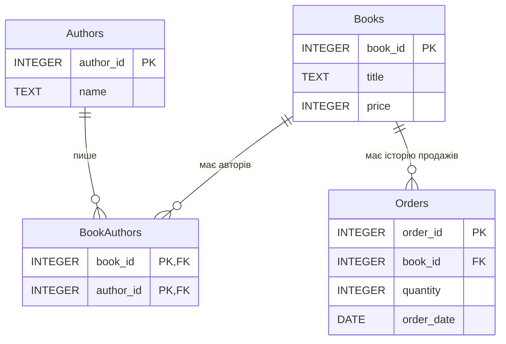

Відповідна діаграма у форматі PlantUML:

```cs
@startuml

entity Authors {
    * author_id : INTEGER <<PK>>
    --
    name : TEXT
}

entity Books {
    * book_id : INTEGER <<PK>>
    --
    title : TEXT
    price : INTEGER
}

entity BookAuthors {
    * book_id : INTEGER <<PK,FK>>
    * author_id : INTEGER <<PK,FK>>
}

entity Orders {
    * order_id : INTEGER <<PK>>
    --
    book_id : INTEGER <<FK>>
    quantity : INTEGER
    order_date : DATE
}

Authors ||--o{ BookAuthors
Books ||--o{ BookAuthors
Books ||--o{ Orders

@enduml
```

**Основні операції:**

- додавання автора;
- додавання книги із вказанням її автора / авторів;
- реєстрація продажу книги;
- перегляд списку авторів;
- перегляд списку книг;
- отримання списку проданих книг певного автора;

**Додаткові завдання:**

- Реалізувати обробку помилки `sqlite3.IntegrityError` у випадку спроби вставити дані, що порушують констрейнти (наприклад, додати книгу неіснуючому автору, або додта замовлення книги з неіснуючим ID);
- Використати агрегатні функції (`COUNT`, `SUM`, `AVG`, `GROUP BY`) для створення методу виведення статистики (наприклад, "Топ-3 найпопулярніших книг").

### Реалізація на Python з використанням SQLite

```python
import sqlite3
from datetime import date

class BookstoreDBManager:
    def __init__(self, db_name="bookstore.db"):
        self.db_name = db_name
        self.init_db()

    def _get_connection(self):
        conn = sqlite3.connect(self.db_name)
        conn.execute("PRAGMA foreign_keys = ON;")
        return conn

    def init_db(self):
        """Створення таблиць за допомогою декларативних SQL-запитів"""
        with self._get_connection() as conn:
            cursor = conn.cursor()
            
            # 1. Таблиця Авторів
            cursor.execute('''
                CREATE TABLE IF NOT EXISTS Authors (
                    author_id INTEGER PRIMARY KEY AUTOINCREMENT,
                    name TEXT NOT NULL
                )
            ''')
            
            # 2. Таблиця Книг
            cursor.execute('''
                CREATE TABLE IF NOT EXISTS Books (
                    book_id INTEGER PRIMARY KEY AUTOINCREMENT,
                    title TEXT NOT NULL,
                    price INTEGER NOT NULL CHECK(price >= 0)
                )
            ''')
            
            # 3. Таблиця, що зв'язує Авторів та Книги (реалізація зв'язку багато-до-багатьох)
            cursor.execute('''
                CREATE TABLE IF NOT EXISTS BookAuthors (
                    book_id INTEGER NOT NULL,
                    author_id INTEGER NOT NULL,
                    PRIMARY KEY (book_id, author_id),
                    FOREIGN KEY(book_id) REFERENCES Books(book_id) ON DELETE CASCADE,
                    FOREIGN KEY(author_id) REFERENCES Authors(author_id) ON DELETE CASCADE
                )
            ''')

            # 4. Таблиця Замовлень/Продажів
            cursor.execute('''
                CREATE TABLE IF NOT EXISTS Orders (
                    order_id INTEGER PRIMARY KEY AUTOINCREMENT,
                    book_id INTEGER NOT NULL,
                    quantity INTEGER NOT NULL CHECK(quantity > 0),
                    order_date DATE NOT NULL,
                    FOREIGN KEY(book_id) REFERENCES Books(book_id) ON DELETE CASCADE
                )
            ''')
            conn.commit()

    def add_author(self, name):
        """Додавання Автора"""
        try:
            with self._get_connection() as conn:
                cursor = conn.cursor()
                cursor.execute(
                    "INSERT INTO Authors (name) VALUES (?)", 
                    (name,)
                )
                conn.commit()
                return cursor.lastrowid
        except sqlite3.Error as e:
            print(f"Помилка БД при додаванні автора: {e}")
            return None

    def get_author_name(self, author_id):
        """Отримати ім'я автора за ID"""
        with self._get_connection() as conn:
            cursor = conn.cursor()
            cursor.execute(
                "SELECT name FROM Authors WHERE author_id = ?",
                (author_id,)
            )
            result = cursor.fetchone()
            return result[0] if result else None

    def add_book(self, title, price, author_ids):
        try:
            with self._get_connection() as conn:
                cursor = conn.cursor()
                cursor.execute(
                    "INSERT INTO Books (title, price) VALUES (?, ?)",
                    (title, price)
                )
                book_id = cursor.lastrowid
                for author_id in author_ids:
                    cursor.execute(
                        '''
                        INSERT INTO BookAuthors (book_id, author_id) VALUES (?, ?)
                        ''',
                        (book_id, author_id)
                    )
                conn.commit()
                return book_id
        except sqlite3.IntegrityError:
            print("Один із авторів не існує.")
            return None

    def sell_book(self, book_id, quantity):
        """Реєстрація продажу книги"""
        try:
            with self._get_connection() as conn:
                cursor = conn.cursor()
                today = date.today().isoformat()
                cursor.execute(
                    "INSERT INTO Orders (book_id, quantity, order_date) VALUES (?, ?, ?)", 
                    (book_id, quantity, today)
                )
                conn.commit()
                return cursor.lastrowid
        except sqlite3.IntegrityError:
            print(f"Помилка: Книги з ID {book_id} не існує.")
            return None
        except sqlite3.Error as e:
            print(f"Помилка БД: {e}")
            return None

    def get_all_authors(self):
        """Виведення всіх авторів"""
        with self._get_connection() as conn:
            cursor = conn.cursor()
            cursor.execute("SELECT * FROM Authors")
            return cursor.fetchall()

    def get_all_books(self):
        with self._get_connection() as conn:
            cursor = conn.cursor()
            cursor.execute('''
                SELECT b.book_id, b.title, b.price, GROUP_CONCAT(a.name, ', ')
                FROM Books b JOIN BookAuthors ba ON b.book_id = ba.book_id
                JOIN Authors a ON ba.author_id = a.author_id
                GROUP BY b.book_id
            ''')
            return cursor.fetchall()

    def get_sold_books_by_author(self, author_id):
        """Виведення всіх проданих книг певного автора"""
        with self._get_connection() as conn:
            cursor = conn.cursor()
            cursor.execute('''
                SELECT a.name, b.title, o.quantity, o.order_date, b.price * o.quantity
                    FROM Orders o JOIN Books b ON o.book_id = b.book_id
                    JOIN BookAuthors ba ON b.book_id = ba.book_id
                    JOIN Authors a ON ba.author_id = a.author_id
                    WHERE a.author_id = ?
                    ORDER BY o.order_date DESC
                ''', (author_id,))
            return cursor.fetchall()

    def get_top_3_books(self):
        """Топ-3 найпопулярніших книг"""
        with self._get_connection() as conn:
            cursor = conn.cursor()
            cursor.execute('''
                SELECT b.title, GROUP_CONCAT(a.name, ', ') AS authors,
                    SUM(o.quantity) AS total_sold,
                    COUNT(o.order_id) AS sales_count,
                    AVG(o.quantity) AS avg_per_order
                FROM Orders o JOIN Books b ON o.book_id = b.book_id
                JOIN BookAuthors ba ON b.book_id = ba.book_id
                JOIN Authors a ON ba.author_id = a.author_id
                GROUP BY b.book_id
                ORDER BY total_sold DESC
                LIMIT 3
            ''')
            return cursor.fetchall()

# Інтерфейс користувача
def main():
    db = BookstoreDBManager()
    
    menu = """
       МЕНЮ КНИЖКОВОГО МАГАЗИНУ
    1. Додати автора
    2. Додати книгу
    3. Зареєструвати продаж (замовлення)
    4. Показати список усіх авторів
    5. Показати список усіх книг
    6. Звіт: Продані книги конкретного автора
    7. Статистика: Топ-3 найпопулярніших книг
    8. Вихід
    """

    while True:
        print(menu)
        choice = input("Оберіть дію: ").strip()

        if choice == '1':
            name = input("Ім'я автора: ").strip()
            if name:
                a_id = db.add_author(name)
                if a_id: print(f"Успішно додано автора з ID: {a_id}")
            else:
                print("Ім'я автора не може бути порожнім.")
            
        elif choice == '2':
            print("\nДоступні автори:")
            for a in db.get_all_authors():
                print(f"ID: {a[0]} | {a[1]}")
            try:
                authors = input("\nВведіть ID авторів через кому: ")
                author_ids = [int(a.strip()) for a in authors.split(',')]
                title = input("Назва книги: ").strip()
                price = int(input("Ціна книги (грн): "))
                b_id = db.add_book(title, price, author_ids)
                if b_id:
                    print(f"Успішно додано книгу з ID: {b_id}")
            except ValueError:
                print("Помилка: ID авторів та ціна мають бути числами.")
            
        elif choice == '3':
            print("\nДоступні книги:")
            for b in db.get_all_books():
                print(f"ID: {b[0]} | '{b[1]}' | Ціна: {b[2]} грн | Автор: {b[3]}")
                
            try:
                book_id = int(input("\nВведіть ID книги для продажу: "))
                quantity = int(input("Кількість екземплярів: "))
                
                o_id = db.sell_book(book_id, quantity)
                if o_id: print(f"Продаж зареєстровано. Номер чеку: {o_id}")
            except ValueError:
                print("Помилка: ID книги та кількість екземплярів мають бути числами.")
            
        elif choice == '4':
            print("\n    СПИСОК АВТОРІВ: ")
            authors = db.get_all_authors()
            if not authors: print("В базі даних немає жодного автора.")
            for a in authors:
                print(f"{a[0]}. {a[1]}")
                
        elif choice == '5':
            print("\n    СПИСОК КНИГ: ")
            books = db.get_all_books()
            if not books: print("В базі даних немає жодної книги.")
            for b in books:
                print(f"{b[0]}. '{b[1]}' {b[3]} ({b[2]} грн)")
                
        elif choice == '6':
            try:
                author_id = int(input("Введіть ID автора для перегляду продажів: "))
                author_name = db.get_author_name(author_id)
                if not author_name:
                    print(f"Автора з ID {author_id} не існує.")
                    continue
                sales = db.get_sold_books_by_author(author_id)
                print(f"\n ЗВІТ З ПРОДАЖІВ ДЛЯ АВТОРА {author_name}")
                if not sales:
                    print(f"У автора {author_name} ще немає проданих книг.")
                else:
                    for s in sales:
                        print(f"Автор: {s[0]} | Книга: '{s[1]}' | Кількість: {s[2]} шт. | Дата: {s[3]} | На суму: {s[4]} грн")
            except ValueError:
                print("Помилка: ID автора має бути числом")

        elif choice == '7':
            top_books = db.get_top_3_books()

            print("    ТОП-3 НАЙПОПУЛЯРНІШИХ КНИГ")

            if not top_books:
                print("Продажів поки що немає.")
            else:
                for i, book in enumerate(top_books, start=1):
                    print(
                        f"{i}. '{book[0]}' | Автор: {book[1]}\n"
                        f"   Продано екземплярів: {book[2]}\n"
                        f"   Кількість продажів: {book[3]}\n"
                        f"   Середня кількість у замовленні: {round(book[4], 2)}\n"
                    )

        elif choice == '8':
            print("Роботу завершено.")
            break
        else:
            print("Невідома команда.")

if __name__ == "__main__":
    main()
```

## Посилання на код програми на Github

https://github.com/vladimirbai08/MPMP/Lab6

## Приклади тестування

- Додавання нового автора:

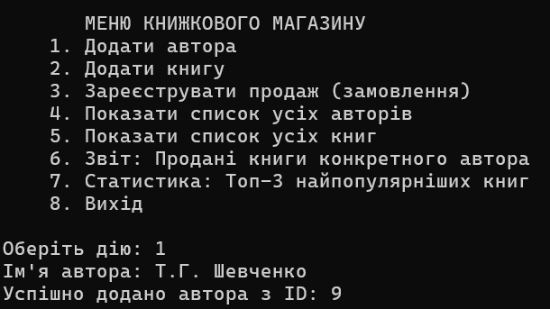

- Додавання нової книги:

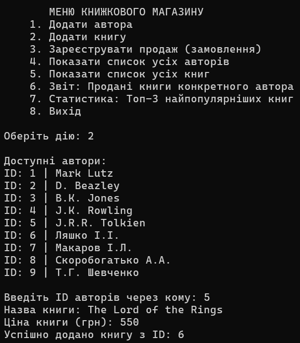

- Обробка помилки - додавання нової книги з автором, ID якого не існує:

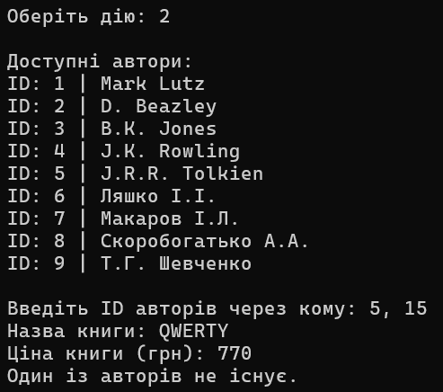

- Реєстрація продажу книги:

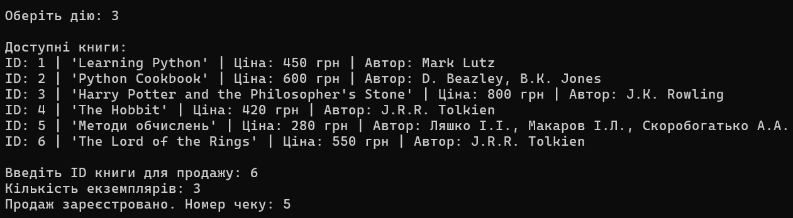

- Обробка помилки - реєстрація продажу книги з неіснуючим ID:

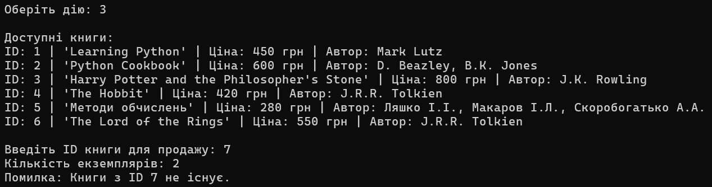

- Вивести всіх авторів:

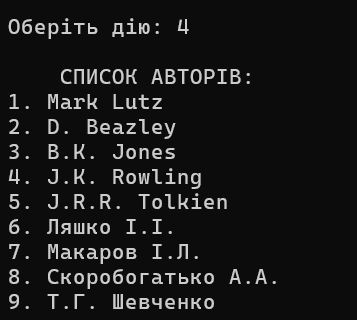

- Вивести всі книги:

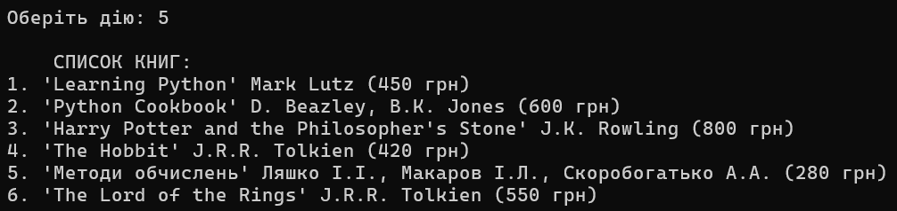

- Вивести продані книги певного автора:

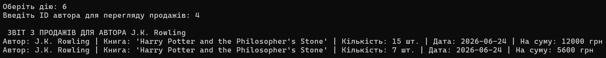

- Обробка помилки - вивести продані книги автора з неіснуючим ID:

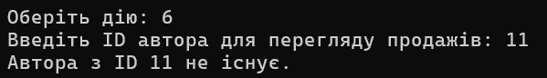

- Вивести Топ-3 найпопулярніший книг:

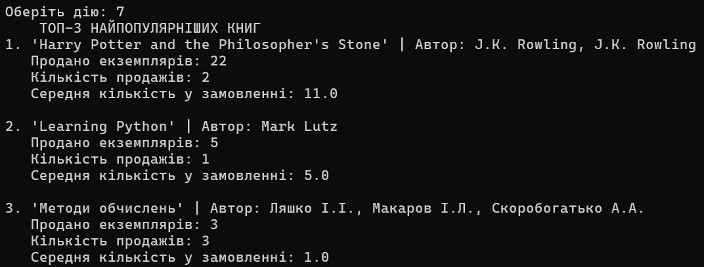

# Висновки

У ході виконання лабораторної роботи було досліджено декларативну парадигму програмування на прикладі мови SQL та системи керування базами даних SQLite.

Було спроєктовано реляційну базу даних для інформаційної системи **«Книжковий магазин»**, яка складається з чотирьох взаємопов'язаних таблиць: `Authors`, `Books`, `BookAuthors` та `Orders`.

У процесі роботи реалізовано основні CRUD-операції: створення, читання, оновлення та видалення даних, а також складні SQL-запити з використанням оператора `JOIN`.

Для взаємодії застосунку з базою даних використано стандартну бібліотеку Python `sqlite3`, а роботу з БД інкапсульовано в окремому класі відповідно до принципів об'єктно-орієнтованого програмування.

Отримані результати підтвердили ефективність поєднання декларативного підходу SQL та об'єктно-орієнтованого підходу Python під час розробки прикладних інформаційних систем.