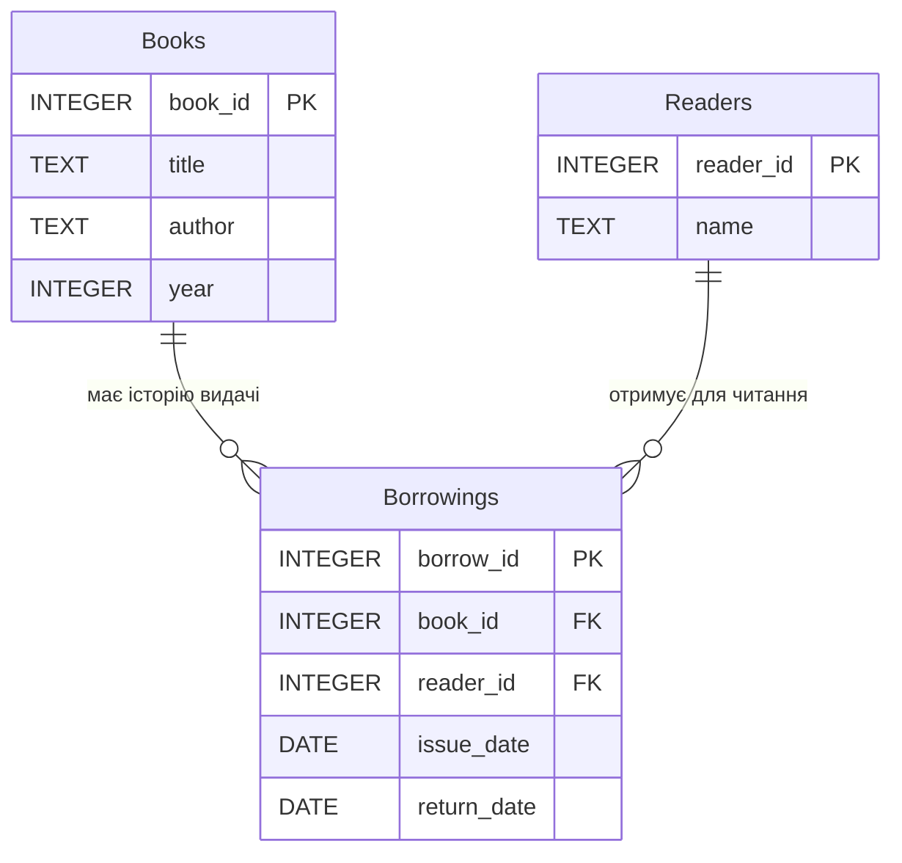

# Лабораторна робота №6. Використання декларативної парадигми програмування (SQL) та взаємодія з базами даних (SQLite) у Python

## Мета

Ознайомитись з декларативною парадигмою програмування на прикладі мови структурованих запитів (SQL). Навчитися проектуванню реляційних баз даних, створенню таблиць, виконанню базових CRUD операцій (Create, Read, Update, Delete) та складних запитів з використанням об'єднання таблиць (JOIN).
Засвоїти принципи інтеграції бази даних (на прикладі SQLite) у прикладну програму на Python за допомогою стандартної бібліотеки sqlite3, поєднуючи декларативний підхід до даних з об'єктно-орієнтованим підходом до архітектури застосунку.

## Задача

Виконати реалізацію простої інформаційної системи, що використовує локальну реляційну базу даних SQLite для збереження, фільтрації та обробки інформації. Опис інформаційної системи визначається за допомогою індивідуального варіанту.

Універсальні вимоги для всіх варіантів - що кожне завдання повинно містити:

- використання СУБД SQLite (файл бази даних має створюватися автоматично);
- мінімум 3 пов'язані таблиці у базі даних (наявність первинних PRIMARY KEY та зовнішніх ключів FOREIGN KEY);
- реалізацію відношення "один-до-багатьох" або "багато-до-багатьох" через проміжну таблицю;
- виконання SQL-запитів для додавання даних (INSERT), читання з фільтрацією (SELECT ... WHERE), оновлення (UPDATE) - та видалення (DELETE);
- використання об'єднання таблиць (JOIN) мінімум в одному запиті;
- обгортку для роботи з БД у вигляді Python-класів (ООП);
- консольне меню для взаємодії з користувачем;
- обробку винятків бази даних (наприклад, sqlite3.IntegrityError)

---

## Перелік індивідуальних варіантів

Нижче подано 20 індивідуальних завдань. Усі завдання передбачають: проектування БД з 3+ таблицями, написання SQL-запитів та їх виклик з Python-програми.

1. **Інформаційна система "Книжковий магазин"**

    *Таблиці*: `Authors` (Автори), `Books` (Книги), `Orders` (Замовлення/Продажі).

    *Запити*: Додавання книги автору, продаж книги, виведення всіх проданих книг певного автора за допомогою JOIN.

2. **Інформаційна система "Автопарк"**

    *Таблиці*: `Drivers` (Водії), `Vehicles` (Автомобілі), `Trips` (Журнал поїздок).

    *Запити*: Закріплення авто за водієм на поїздку, завершення поїздки, список усіх поїздок обраного водія.

3. Інформаційна система управління навчальними курсами

    *Таблиці*: `Instructors` (Викладачі), `Courses` (Курси), `Enrollments` (Записи студентів на курс).

    *Запити*: Створення курсу, запис студента, виведення списку курсів, які веде конкретний викладач з підрахунком студентів.

4. Інформаційна система "Кінотеатр"

    *Таблиці*: `Movies` (Фільми), `Sessions` (Сеанси), `Tickets` (Продані квитки).

    *Запити*: Додавання сеансу, продаж квитка на сеанс, розрахунок кількості вільних місць на сеанс.

5. Інформаційна система "Поліклініка"

    *Таблиці*: `Doctors` (Лікарі), `Patients` (Пацієнти), `Appointments` (Прийоми).

    *Запити*: Реєстрація пацієнта, призначення прийому, список пацієнтів лікаря на певну дату.

6. Інформаційна система "Товарний склад"

    *Таблиці*: `Categories` (Категорії), `Products` (Товари), `Movements` (Рух товарів: прихід/витрата).

    *Запити*: Додавання товару, реєстрація приходу, отримання поточного залишку товару на складі.

7. Інформаційна система "Музичний каталог"

    *Таблиці*: `Artists` (Виконавці), `Albums` (Альбоми), `Tracks` (Треки).

    *Запити*: Додавання альбому виконавцю, додавання треку, пошук усіх треків заданого виконавця.

8. Інформаційна система керування спортзалом

    *Таблиці*: `Clients` (Клієнти), `Trainers` (Тренери), `Workouts` (Тренування).

    *Запити*: Реєстрація клієнта, призначення тренування, перелік всіх тренувань клієнта з іменами тренерів.

9. Інформаційна система банківських операцій

    *Таблиці*: `Clients` (Клієнти), `Accounts` (Рахунки), `Transactions` (Транзакції).

    *Запити*: Відкриття рахунку, переказ коштів між рахунками (дві транзакції), історія операцій по рахунку.

10. Інформаційна система туристичного агентства

    *Таблиці*: `Hotels` (Готелі), `Tours` (Тури), `Bookings` (Бронювання клієнтів).

    *Запити*: Додавання туру до готелю, бронювання туру, список усіх бронювань для конкретного туру.

11. Інформаційна система служби доставки їжі

    *Таблиці*: `Restaurants` (Ресторани), `Dishes` (Страви), `OrderItems` (Позиції у замовленнях).

    *Запити*: Створення страви в меню ресторану, додавання страви у замовлення, виведення повного чеку (переліку страв) замовлення.

12. Інформаційна система управління університетом

    *Таблиці*: `Departments` (Кафедри), `Professors` (Викладачі), `Subjects` (Дисципліни).

    *Запити*: Прикріплення викладача до кафедри, призначення дисципліни викладачу, список усіх дисциплін обраної кафедри.

13. Інформаційна система "Закупівлі магазину електроніки"

    *Таблиці*: `Suppliers` (Постачальники), `Devices` (Техніка), `Purchases` (Журнал закупівель).

    *Запити*: Реєстрація нової поставки товару, виведення списку всієї техніки від конкретного постачальника, підрахунок загальної суми закупівлі для певного бренду через JOIN.

14. Інформаційна система "Агентство нерухомості"

    *Таблиці*: `Agents` (Ріелтори), `Properties` (Об'єкти нерухомості), `Deals` (Угоди про продаж/оренду).

    *Запити*: Додавання нового об'єкта нерухомості, оформлення угоди, перегляд усіх успішних операцій конкретного агента з назвами об'єктів.

15. Інформаційна система керування конференцією

    *Таблиці*: `Speakers` (Спікери), `Topics` (Доповіді), `Schedule` (Розклад виступів у залах).

    *Запити*: Реєстрація виступу спікера, пошук усіх доповідей, що відбуваються в конкретному залі, список тем, які презентує обраний спікер.

16. Інформаційна система "Сервісний центр" (Ремонт техніки)

    *Таблиці*: `Clients` (Клієнти), `Equipment` (Пристрої), `ServiceOrders` (Замовлення на ремонт).

    *Запити*: Прийом пристрою на ремонт від клієнта, зміна статусу замовлення (в роботі/готово), історія обслуговування конкретного пристрою за його ID.

17. Інформаційна система "Ветеринарна клініка"

    *Таблиці*: `Owners` (Власники), `Pets` (Тварини), `Visits` (Журнал візитів до лікарів).

    *Запити*: Реєстрація нової тварини та її власника, запис на прийом, перегляд повної медичної історії тварини (дата візиту та опис процедур).

18. Інформаційна система обліку оргтехніки в офісі

    *Таблиці*: `Departments` (Відділи), `Employees` (Співробітники), `Inventory` (Обладнання).

    *Запити*: Закріплення обладнання за конкретним співробітником, список всієї техніки, що належить певному відділу, пошук пристрою за інвентарним номером.

19. Інформаційна система "Салон краси"

    *Таблиці*: `Masters` (Майстри), `Services` (Послуги), `Appointments` (Записи клієнтів).

    *Запити*: Створення графіку майстра, запис клієнта на конкретну послугу до обраного майстра, виведення списку записів на сьогодні з розрахунком вартості.

20. Інформаційна система "Кур’єрська служба"

    *Таблиці*: `Couriers` (Кур'єри), `Clients` (Клієнти/Отримувачі), `Deliveries` (Посилки та їх доставка).

    *Запити*: Призначення кур'єра на доставку нової посилки, зміна статусу доставки (в дорозі/доставлено), звіт про всі посилки, доставлені певним кур'єром за вказаний період.

## Зразковий варіант завдання

Необхідно розробити програму, що моделює роботу бібліотеки з використанням бази даних SQLite.
У системі повинні зберігатися дані про книги, читачів та факт видачі книг.

*Функціональні вимоги*:

- Створення необхідних таблиць під час першого запуску програми.
- Додавання нових книг та читачів.
- Видача книги читачу (додавання запису в проміжну таблицю).
- Повернення книги (оновлення запису в проміжній таблиці).
- Перегляд доступних книг (які зараз не знаходяться у читачів).
- Перегляд книг, які наразі перебувають на руках у конкретного читача (з використанням JOIN)

*Обов’язкові вимоги до реалізації*:

- SQL запити повинні бути винесені в методи окремого класу-менеджера (наприклад, DatabaseManager).
- Використання параметризованих запитів `?` для захисту від SQL-ін'єкцій.
- Код має бути структурований.
- Взаємодія з програмною через консольний інтерфейс.

## Розробка та реалізація програми для зразкового варіанту

### Структура бази даних

Для реалізації відношення багато-до-багатьох (читач може взяти багато книг, книга з часом може бути у багатьох читачів) створюємо 3 таблиці:

`Books`: поля `book_id` (PK), `title`, `author`, `year`
`Readers`: поля `reader_id` (PK), `name`
`Borrowings`: поля `borrow_id` (PK), `book_id` (FK), `reader_id` (FK), `issue_date`, `return_date`

ER-діаграма у форматі Mermaid:



Відповідна діаграма у форматі PlantUML:

```cs
@startuml
entity "Books" as books {
  *book_id : INTEGER <<PK>>
  --
  title : TEXT
  author : TEXT
  year : INTEGER
}

entity "Readers" as readers {
  *reader_id : INTEGER <<PK>>
  --
  name : TEXT
}

entity "Borrowings" as borrowings {
  *borrow_id : INTEGER <<PK>>
  --
  book_id : INTEGER <<FK>>
  reader_id : INTEGER <<FK>>
  issue_date : DATE
  return_date : DATE
}

books ||--o{ borrowings
readers ||--o{ borrowings
@enduml
```

### Реалізація на Python

Нижче наведено приклад реалізації завдання з використанням стандартної бібліотеки sqlite3.

```python
import sqlite3
from datetime import date

class LibraryDBManager:
    def __init__(self, db_name="library.db"):
        self.db_name = db_name
        self.init_db()

    def _get_connection(self):
        return sqlite3.connect(self.db_name)

    def init_db(self):
        """Створення таблиць за допомогою декларативних SQL-запитів"""
        with self._get_connection() as conn:
            cursor = conn.cursor()
            
            # Таблиця Книг
            cursor.execute('''
                CREATE TABLE IF NOT EXISTS Books (
                    book_id INTEGER PRIMARY KEY AUTOINCREMENT,
                    title TEXT NOT NULL,
                    author TEXT NOT NULL,
                    year INTEGER
                )
            ''')
            
            # Таблиця Читачів
            cursor.execute('''
                CREATE TABLE IF NOT EXISTS Readers (
                    reader_id INTEGER PRIMARY KEY AUTOINCREMENT,
                    name TEXT NOT NULL
                )
            ''')
            
            # Таблиця Видачі (Журнал)
            cursor.execute('''
                CREATE TABLE IF NOT EXISTS Borrowings (
                    borrow_id INTEGER PRIMARY KEY AUTOINCREMENT,
                    book_id INTEGER NOT NULL,
                    reader_id INTEGER NOT NULL,
                    issue_date DATE NOT NULL,
                    return_date DATE,
                    FOREIGN KEY(book_id) REFERENCES Books(book_id),
                    FOREIGN KEY(reader_id) REFERENCES Readers(reader_id)
                )
            ''')
            conn.commit()

    def add_book(self, title, author, year):
        with self._get_connection() as conn:
            cursor = conn.cursor()
            cursor.execute(
                "INSERT INTO Books (title, author, year) VALUES (?, ?, ?)", 
                (title, author, year)
            )
            conn.commit()
            return cursor.lastrowid

    def add_reader(self, name):
        with self._get_connection() as conn:
            cursor = conn.cursor()
            cursor.execute("INSERT INTO Readers (name) VALUES (?)", (name,))
            conn.commit()
            return cursor.lastrowid

    def issue_book(self, book_id, reader_id):
        with self._get_connection() as conn:
            cursor = conn.cursor()
            # Перевірка, чи не видана книга зараз
            cursor.execute('''
                SELECT borrow_id FROM Borrowings 
                WHERE book_id = ? AND return_date IS NULL
            ''', (book_id,))
            if cursor.fetchone():
                return False, "Книга вже видана і ще не повернута."

            today = date.today().isoformat()
            cursor.execute(
                "INSERT INTO Borrowings (book_id, reader_id, issue_date) VALUES (?, ?, ?)", 
                (book_id, reader_id, today)
            )
            conn.commit()
            return True, "Книгу успішно видано."

    def return_book(self, book_id, reader_id):
        with self._get_connection() as conn:
            cursor = conn.cursor()
            today = date.today().isoformat()
            
            cursor.execute('''
                UPDATE Borrowings 
                SET return_date = ? 
                WHERE book_id = ? AND reader_id = ? AND return_date IS NULL
            ''', (today, book_id, reader_id))
            
            if cursor.rowcount == 0:
                return False, "Запис про видачу не знайдено (або книгу вже повернуто)."
            
            conn.commit()
            return True, "Книгу успішно повернуто."

    def get_available_books(self):
        """Використання вкладеного запиту для пошуку доступних книг"""
        with self._get_connection() as conn:
            cursor = conn.cursor()
            cursor.execute('''
                SELECT book_id, title, author FROM Books 
                WHERE book_id NOT IN (
                    SELECT book_id FROM Borrowings WHERE return_date IS NULL
                )
            ''')
            return cursor.fetchall()

    def get_reader_books(self, reader_id):
        """Використання JOIN для отримання даних з кількох таблиць"""
        with self._get_connection() as conn:
            cursor = conn.cursor()
            cursor.execute('''
                SELECT b.book_id, b.title, b.author, br.issue_date
                FROM Borrowings br
                JOIN Books b ON br.book_id = b.book_id
                WHERE br.reader_id = ? AND br.return_date IS NULL
            ''', (reader_id,))
            return cursor.fetchall()

# Інтерфейс користувача
def main():
    db = LibraryDBManager()
    
    menu = """
    1. Додати книгу
    2. Додати читача
    3. Видати книгу
    4. Повернути книгу
    5. Показати доступні книги
    6. Показати книги на руках у читача
    7. Вихід
    """

    while True:
        print(menu)
        choice = input("Оберіть дію: ")

        if choice == '1':
            title = input("Назва: ")
            author = input("Автор: ")
            year = int(input("Рік: "))
            b_id = db.add_book(title, author, year)
            print(f"Книгу додано! ID: {b_id}")
            
        elif choice == '2':
            name = input("Ім'я читача: ")
            r_id = db.add_reader(name)
            print(f"Читача зареєстровано! ID: {r_id}")
            
        elif choice == '3':
            b_id = int(input("ID книги: "))
            r_id = int(input("ID читача: "))
            success, msg = db.issue_book(b_id, r_id)
            print(msg)
            
        elif choice == '4':
            b_id = int(input("ID книги: "))
            r_id = int(input("ID читача: "))
            success, msg = db.return_book(b_id, r_id)
            print(msg)
            
        elif choice == '5':
            books = db.get_available_books()
            print("\n--- Доступні книги ---")
            for b in books:
                print(f"[{b[0]}] {b[1]} - {b[2]}")
                
        elif choice == '6':
            r_id = int(input("ID читача: "))
            books = db.get_reader_books(r_id)
            print(f"\n--- Книги читача #{r_id} ---")
            for b in books:
                print(f"[{b[0]}] {b[1]} (видано: {b[3]})")
                
        elif choice == '7':
            print("Роботу завершено.")
            break
        else:
            print("Невідома команда.")

if __name__ == "__main__":
    main()
```

### Приклади варіантів додаткових завдань (для отримання додаткових балів)

- Реалізувати обробку помилки `sqlite3.IntegrityError` у випадку спроби вставити дані, що порушують констрейнти (наприклад, неіснуючий зовнішній ключ).
- Використати агрегатні функції (`COUNT`, `SUM`, `AVG`, `GROUP BY`) для створення методу виведення статистики (наприклад, "топ-3 найпопулярніших книг" або "найактивніші читачі").
- Реалізувати пошук даних за частковим співпадінням (`LIKE` оператор).
- Використати контекстні менеджери для транзакцій (забезпечити відкат змін (`ROLLBACK`), якщо сталася помилка під час виконання кількох зв'язаних запитів).

### Приклад реалізації додаткового завдання

Для реалізації статистики "Найактивніші читачі" нам потрібно об'єднати таблиці Readers та Borrowings, порахувати кількість записів про видачу (`COUNT`) для кожного читача (`GROUP BY`), відсортувати результат за спаданням кількості (`ORDER BY ... DESC`) та обмежити вивід кількома лідерами (`LIMIT`).

Ось що саме потрібно змінити та додати у попередній код:

1. Додавання методу в клас `LibraryDBManager`
    У клас `LibraryDBManager` потрібно додати новий метод `get_top_readers`. Він виконуватиме SQL-запит для підрахунку книг, які брав кожен читач (включно з тими, що вже повернуті).

    ```python
    def get_top_readers(self, limit=3):
            """Отримання топ-N найактивніших читачів за допомогою COUNT та GROUP BY"""
            with self._get_connection() as conn:
                cursor = conn.cursor()
                # Використовуємо JOIN для об'єднання читачів та історії видачі,
                # COUNT для підрахунку книг, GROUP BY для групування по читачах,
                # ORDER BY для сортування за спаданням та LIMIT для обмеження кількості.
                cursor.execute('''
                    SELECT r.name, COUNT(br.borrow_id) as borrowed_count
                    FROM Readers r
                    JOIN Borrowings br ON r.reader_id = br.reader_id
                    GROUP BY r.reader_id
                    ORDER BY borrowed_count DESC
                    LIMIT ?
                ''', (limit,))
                return cursor.fetchall()
    ```

    Як працює запит:

    - `JOIN Borrowings br ON r.reader_id = br.reader_id` — знаходить всі записи видачі для конкретного читача.
    - `COUNT(br.borrow_id)` — рахує загальну кількість таких записів (скільки разів читач брав книги).
    - `GROUP BY r.reader_id` — вказує базі даних, що рахувати потрібно не всі рядки загалом, а окремо для кожного унікального читача.
    - `ORDER BY borrowed_count DESC` — сортує список так, щоб читачі з найбільшою кількістю книг опинилися на початку.

2. Оновлення консольного меню та логіки в main()
    Тепер потрібно додати новий пункт до меню та обробити його виклик у головному циклі програми.

    Оновлене меню:

    ```python
    menu = """
        1. Додати книгу
        2. Додати читача
        3. Видати книгу
        4. Повернути книгу
        5. Показати доступні книги
        6. Показати книги на руках у читача
        7. Статистика: Найактивніші читачі
        8. Вихід
        """
    ```

    Додавання обробки в цикл while True: новий блок `elif choice == '7'`: (та змінити номер пункту "Вихід" на 8).

    ```python
    # ... попередні пункти меню ...

            elif choice == '7':
                limit = 3 # Можна запитати у користувача, скільки читачів виводити
                top_readers = db.get_top_readers(limit)
                
                print(f"\n--- ТОП-{limit} найактивніших читачів ---")
                if not top_readers:
                    print("Історія видачі поки що порожня.")
                else:
                    for idx, reader in enumerate(top_readers, 1):
                        # reader[0] - ім'я, reader[1] - кількість взятих книг
                        print(f"{idx}. {reader[0]} — взято книг: {reader[1]}")
                    
            elif choice == '8':
                print("Роботу завершено.")
                break
            else:
                print("Невідома команда.")
    ```

## Документування виконаної роботи

За результатами роботи скласти звіт. До звіту необхідно включити:

- опис індивідуального завдання;
- структуру бази даних у вигляді ER-діаграми (за допомогою Mermaid, PlantUML або інших засобів проектування, додавши графічне зображення до звіту);
- код Python-програми, з обов'язковим коментарем ключових SQL-запитів;
- варіант початкових даних та знімки екрану (скріншоти) терміналу, що підтверджують успішне виконання всіх заявлених в завданні операцій;
- файл бази даних `.db` (додати до переліку файлів, що прикріплюються до завдання) або скріншот з відкритою базою даних у сторонньому клієнті (наприклад, SQLiteStudio, DB Browser for SQLite);
- висновки щодо різниці між декларативним підходом управління даними (через SQL) та процедурним/ООП (в Python).

## Корисні посилання для роботи з БД SQLite

1. [DB Browser for SQLite](https://sqlitebrowser.org/) - Open source tool to create, search, and edit SQLite database files.
2. [SQLiteStudio](https://sqlitestudio.pl/) - Desktop application for creating, browsing and editing SQLite database files.
3. [SQLite Viewer Web App](https://sqliteviewer.app/) - Free, web-based SQLite Explorer. Use this web-based tool to quickly and easily inspect SQLite files.
4. [SQLite Viewer](https://www.sqliteview.com/) - Open SQLite Files In Your Browser. Browse tables, run SQL, edit rows, export data, and visualize SQLite databases directly in your browser. No uploads, no installs, and your data stays local.

## Контрольні питання

1. У чому полягає суть декларативної парадигми і як вона проявляється у мові SQL?
2. Яка різниця між первинним (PRIMARY KEY) та зовнішнім (FOREIGN KEY) ключами?
3. Для чого використовується оператор JOIN та які його основні види існують?
4. Що таке SQL-ін'єкція і як параметризовані запити (використання ? в sqlite3) допомагають від неї захиститись?
5. Чому для збереження складних взаємозв'язків даних використання реляційних БД (SQLite) є кращим підходом, ніж збереження у звичайні CSV/JSON файли?
6. Що таке транзакція в базах даних (поняття COMMIT та ROLLBACK)?
