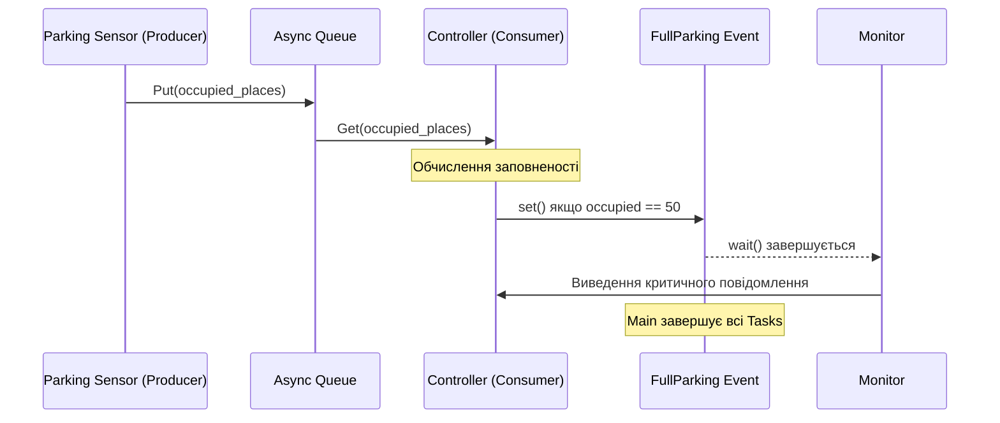
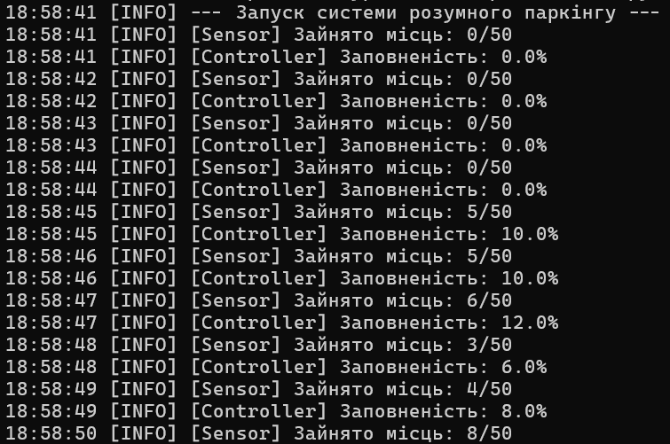
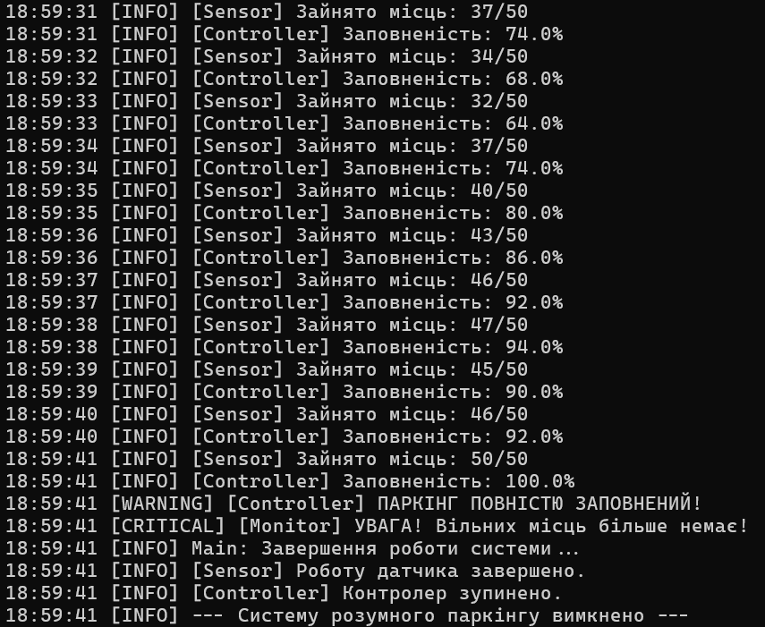

# Бай Володимир, ІКМ-224а

# Звіт з лабораторної роботи №7
# з курсу "Мультипарадигмальні мови програмування"

# Асинхронне програмування та подієво-орієнтована взаємодія у Python за допомогою asyncio

## Мета роботи

Ознайомитись із парадигмою асинхронного програмування та бібліотекою `asyncio`. Навчитися проектувати неблокуючі системи, керувати життєвим циклом асинхронних завдань (`Tasks`), використовувати механізми черг (`Queue`) для взаємодії між компонентами та реалізовувати подієву логіку за допомогою `Event`.

Засвоїти принципи обробки "зворотного тиску" (backpressure) та коректного завершення роботи застосунку (graceful shutdown).

## Задача

Реалізувати програмну систему **«Розумний паркінг»**, що моделює роботу системи моніторингу заповненості паркувальних місць у режимі реального часу.

Необхідно розробити програму, яка імітує надходження інформації про кількість зайнятих місць на паркінгу, аналізує рівень його заповненості та реагує на критичну ситуацію у випадку повного заповнення.

Універсальні вимоги:

- використання бібліотеки `asyncio` для організації конкурентного виконання;
- реалізація щонайменше трьох асинхронних компонентів: **Продюсер** (генерує дані), **Споживач** (обробляє дані), **Монітор** (очікує на подію);
- використання асинхронної черги `asyncio.Queue` з обмеженим розміром для передачі даних;
- використання `asyncio.Event` для сигналізації про критичну ситуацію та зупинку системи;
- реалізація коректного завершення роботи всіх тасків (через `cancel()` та `asyncio.gather`);
- використання бібліотеки `logging` для відображення роботи системи;
- обгортка логіки у вигляді Python-класу (ООП).

### Функціональні вимоги

- Емулятор паркінгу (Producer) генерує кількість зайнятих місць кожну секунду.
- Контролер (Consumer) обчислює відсоток заповненості паркінгу.
- Якщо кількість зайнятих місць дорівнює 50, активується подія `FullParking`.
- Монітор системи (Monitor) очікує на подію та виводить критичне повідомлення про відсутність вільних місць.
- Після спрацювання події програма має коректно завершити роботу всіх асинхронних завдань.

---

## Інформаційна система "Розумний паркінг"

### Структура системи

Для реалізації завдання використано три основні асинхронні компоненти:

- `parking_sensor()` — продюсер, який генерує поточну кількість зайнятих місць;
- `parking_controller()` — споживач, який обчислює відсоток заповненості та перевіряє критичний поріг;
- `parking_monitor()` — монітор, який очікує на виникнення критичної події.

Для взаємодії між компонентами використано:

- асинхронну чергу `asyncio.Queue` із обмеженим розміром (`maxsize=5`);
- подію `asyncio.Event` для повідомлення про повне заповнення паркінгу.

### Схема взаємодії компонентів

Логіка взаємодії компонентів у асинхронному середовищі (Sequence Diagram):



### Основні операції

- генерація випадкової кількості зайнятих місць;
- передача даних через `asyncio.Queue`;
- розрахунок відсотка заповненості паркінгу;
- перевірка досягнення критичного порогу;
- сигналізація про повне заповнення паркінгу;
- коректне завершення роботи всіх асинхронних задач.

### Додаткові можливості

- реалізовано механізм **backpressure** завдяки використанню черги з обмеженим розміром;
- використано обробку винятку `asyncio.CancelledError`;
- для журналювання роботи системи застосовано бібліотеку `logging`.

## Реалізація на Python з використанням asyncio

```python
import asyncio
import random
import logging

# Налаштування логування
logging.basicConfig(
    level=logging.INFO,
    format='%(asctime)s [%(levelname)s] %(message)s',
    datefmt='%H:%M:%S'
)


class SmartParkingSystem:
    def __init__(self, max_places=50):
        # Черга з обмеженим розміром (backpressure)
        self.data_queue = asyncio.Queue(maxsize=5)

        # Подія критичної ситуації
        self.full_parking_event = asyncio.Event()

        # Загальна кількість місць
        self.max_places = max_places

    async def parking_sensor(self):
        """
        Producer: генерує кількість зайнятих місць.
        """
        try:
            occupied_places = 0

            while not self.full_parking_event.is_set():
                # Імітуємо прибуття/виїзд автомобілів
                change = random.randint(-3, 5)
                occupied_places += change

                # Не допускаємо виходу за межі
                occupied_places = max(0, min(occupied_places, self.max_places))

                logging.info(
                    f"[Sensor] Зайнято місць: "
                    f"{occupied_places}/{self.max_places}"
                )

                # Якщо черга повна - producer чекатиме
                await self.data_queue.put(occupied_places)

                await asyncio.sleep(1)

        except asyncio.CancelledError:
            logging.info("[Sensor] Роботу датчика завершено.")

    async def parking_controller(self):
        """
        Consumer: обчислює відсоток заповненості.
        """
        try:
            while not self.full_parking_event.is_set():
                occupied = await self.data_queue.get()

                occupancy_percent = (
                    occupied / self.max_places * 100
                )

                logging.info(
                    f"[Controller] Заповненість: "
                    f"{occupancy_percent:.1f}%"
                )

                # Критична подія
                if occupied == self.max_places:
                    logging.warning(
                        "[Controller] ПАРКІНГ ПОВНІСТЮ ЗАПОВНЕНИЙ!"
                    )
                    self.full_parking_event.set()

                self.data_queue.task_done()

                await asyncio.sleep(0.3)

        except asyncio.CancelledError:
            logging.info("[Controller] Контролер зупинено.")

    async def parking_monitor(self):
        """
        Monitor: очікує на критичну подію.
        """
        await self.full_parking_event.wait()

        logging.critical(
            "[Monitor] УВАГА! Вільних місць більше немає!"
        )


async def main():
    parking = SmartParkingSystem(max_places=50)

    logging.info("--- Запуск системи розумного паркінгу ---")

    tasks = [
        asyncio.create_task(parking.parking_sensor()),
        asyncio.create_task(parking.parking_controller()),
        asyncio.create_task(parking.parking_monitor())
    ]

    # Очікуємо спрацювання події
    event_task = asyncio.create_task(
        parking.full_parking_event.wait()
    )

    await asyncio.wait(
        [event_task],
        return_when=asyncio.FIRST_COMPLETED
    )

    # Graceful shutdown
    logging.info("Main: Завершення роботи системи...")

    for task in tasks:
        task.cancel()

    await asyncio.gather(*tasks, return_exceptions=True)

    logging.info(
        "--- Систему розумного паркінгу вимкнено ---"
    )


if __name__ == "__main__":
    try:
        asyncio.run(main())
    except KeyboardInterrupt:
        logging.info("Програму завершено користувачем.")
```

## Посилання на код програми на Github

https://github.com/vladimirbai08/MPMP/Lab7

## Приклади тестування

- Початок роботи:



- Завершення роботи:




# Висновки

У ході виконання лабораторної роботи було досліджено особливості асинхронного програмування в Python із використанням бібліотеки `asyncio`.

Було розроблено програмну систему **«Розумний паркінг»**, яка моделює процес моніторингу заповненості паркувальних місць у режимі реального часу за патерном **Producer-Consumer**.

У процесі роботи реалізовано асинхронну взаємодію між компонентами системи за допомогою механізмів `asyncio.Queue` та `asyncio.Event`. Продюсер відповідає за генерацію даних, споживач виконує їх аналіз та визначає критичні ситуації, а монітор очікує на виникнення події та повідомляє про повне заповнення паркінгу.

Також було реалізовано механізм коректного завершення роботи застосунку (graceful shutdown) із використанням скасування асинхронних задач (`cancel()`) та функції `asyncio.gather()`. Для відображення роботи системи використано бібліотеку `logging`.

Отримані результати підтвердили ефективність використання асинхронного підходу для розробки систем моніторингу та обробки даних у реальному часі.