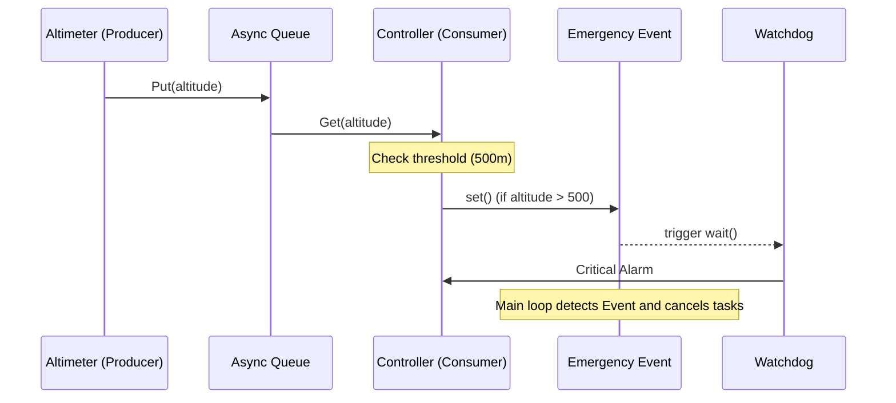

# Лабораторна робота №7. Асинхронне програмування та подієво-орієнтована взаємодія у Python за допомогою asyncio

## Мета

Ознайомитись із парадигмою асинхронного програмування та бібліотекою `asyncio`. Навчитися проектувати неблокуючі системи, керувати життєвим циклом асинхронних завдань (`Tasks`), використовувати механізми черг (`Queue`) для взаємодії між компонентами та реалізовувати подієву логіку за допомогою `Event`. Засвоїти принципи обробки "зворотного тиску" (backpressure) та коректного завершення роботи застосунку (graceful shutdown).

## Задача

Розробити програмну систему, що моделює роботу конвеєра обробки даних у реальному часі за патерном **Producer-Consumer**. Система має складатися з імітатора джерела даних, аналітичного модуля та модуля реагування на критичні події. Опис предметної області та критеріїв спрацювання подій визначається за допомогою індивідуального варіанту.

Універсальні вимоги для всіх варіантів:

- використання бібліотеки `asyncio` для організації конкурентного виконання;
- реалізація щонайменше трьох асинхронних компонентів: **Продюсер** (генерує дані), **Споживач** (обробляє дані), **Монітор** (очікує на подію);
- використання асинхронної черги `asyncio.Queue` з обмеженим розміром для передачі даних;
- використання `asyncio.Event` для сигналізації про критичну ситуацію та зупинку системи;
- реалізація коректного завершення роботи всіх тасків (через `cancel()` та `asyncio.gather`);
- використання бібліотеки `logging` для відображення роботи системи;
- обгортка логіки у вигляді Python-класу (ООП).

---

## Перелік індивідуальних варіантів

Нижче подано 20 індивідуальних завдань. Кожен варіант передбачає імітацію потоку даних, їх статистичну обробку та реакцію на порогове значення.

| № | Об'єкт моніторингу | Обробка (Consumer) | Критична подія (Event) |
| :--- | :--- | :--- | :--- |
| 1 | Розумний паркінг | Розрахунок заповненості у місцях | Заповненість = 50 |
| 2 | Курс криптовалюти (BTC) | Визначення тренду (up/down) | Різке падіння на 2% за крок |
| 3 | Трафік мережевого шлюзу | Сумування об'єму байтів | Об'єм за сесію > 1 ГБ |
| 4 | Рівень вологості в теплиці | Порівняння з референсом | Вологість < 30% |
| 5 | Черга запитів до БД | Підрахунок запитів на секунду | Довжина черги > 50 запитів |
| 6 | Датчик CO2 в офісі | Пошук максимального значення | Рівень > 1000 ppm |
| 7 | Складські залишки | Облік списання товарів | Кількість одиниць < 5 |
| 8 | Логи веб-сервера (коди 404) | Статистика співвідношення помилок | Частка помилок > 20% |
| 9 | Швидкість вітру (Метео) | Переведення з м/с у вузли | Порив вітру > 25 м/с |
| 10 | Датчик тиску в трубах | Пошук медіанного значення | Стрибок тиску > 1.5 атм |
| 11 | Завантаження RAM | Визначення пікового споживання | Використання > 90% |
| 12 | Розумний лічильник енергії | Обчислення вартості за тарифом | Потужність > 5 кВт |
| 13 | Монітор транзакцій | Перевірка на суму вище середньої | Транзакція > 100 000 грн |
| 14 | GPS-трекер авто | Розрахунок пройденої дистанції | Відхилення від маршруту > 500 м |
| 15 | Рівень шуму на виробництві | Аналіз частотного спектра | Шум > 100 дБ |
| 16 | Кількість користувачів online | Швидкість приросту аудиторії | Приріст > 100 кор./хв |
| 17 | Сенсор освітленості | Розрахунок градієнта зміни світла | Раптове затемнення (0 люкс) |
| 18 | Детектор диму (оптичний) | Фільтрація хибних спрацювань | Спрацювання 3 рази поспіль |
| 19 | Валютна пара USD/UAH | Розрахунок різниці купівля/продаж | Спред > 0.50 грн |
| 20 | Датчик вібрації моста | Аналіз амплітуди коливань | Амплітуда > порогу безпеки |

---

## Зразковий варіант завдання

Необхідно розробити систему моніторингу телеметрії **безпілотного літального апарату (БПЛА)**.
Система має відстежувати висоту польоту, передавати її до контролера та ініціювати аварійну посадку, якщо висота перевищує встановлений ліміт.

*Функціональні вимоги*:

- Емулятор датчика (Producer) генерує значення висоти кожні 0.8 сек.
- Контролер польоту (Consumer) перевіряє кожне значення.
- Якщо висота > 500 м, активується подія "Emergency".
- Система безпеки (Watchdog) очікує на подію та виводить критичне попередження.
- Після спрацювання події програма має коректно зупинити всі асинхронні завдання.

## Розробка та реалізація програми для зразкового варіанту

### Схема взаємодії компонентів

Логіка взаємодії компонентів у асинхронному середовищі (Sequence Diagram):



### Реалізація на Python

Нижче наведено приклад реалізації завдання у вигляді програми на Python з використанням бібліотеки `asyncio`.

```python
import asyncio
import random
import logging

# Налаштування логування
logging.basicConfig(level=logging.INFO, format='%(asctime)s [%(levelname)s] %(message)s', datefmt='%H:%M:%S')

class FlightTelemetrySystem:
    def __init__(self, max_alt=500):
        self.data_queue = asyncio.Queue(maxsize=5)
        self.emergency_event = asyncio.Event()
        self.max_altitude = max_alt

    async def altimeter_sensor(self):
        """Продюсер: імітація датчика висоти."""
        try:
            while not self.emergency_event.is_set():
                altitude = random.randint(100, 600)
                logging.info(f"[Sensor] Зчитано висоту: {altitude} м")
                
                # Додавання в чергу з очікуванням, якщо вона повна
                await self.data_queue.put(altitude)
                await asyncio.sleep(0.8)
        except asyncio.CancelledError:
            logging.info("[Sensor] Роботу датчика припинено.")

    async def flight_controller(self):
        """Споживач: аналіз даних та контроль безпеки."""
        try:
            while not self.emergency_event.is_set():
                alt = await self.data_queue.get()
                
                if alt > self.max_altitude:
                    logging.warning(f"[Controller] ПЕРЕВИЩЕННЯ: {alt}м > {self.max_altitude}м!")
                    self.emergency_event.set()
                else:
                    logging.info(f"[Controller] Висота в нормі: {alt}м")
                
                self.data_queue.task_done()
                await asyncio.sleep(0.2)
        except asyncio.CancelledError:
            logging.info("[Controller] Контролер зупинено.")

    async def emergency_system(self):
        """Монітор подій: чекає на сигнал аварії."""
        await self.emergency_event.wait()
        logging.critical("[Emergency] ПРОТОКОЛ АВАРІЙНОЇ ПОСАДКИ АКТИВОВАНО!")

async def main():
    uav = FlightTelemetrySystem()
    logging.info("--- Старт бортових систем ---")

    # Створення тасків
    tasks = [
        asyncio.create_task(uav.altimeter_sensor()),
        asyncio.create_task(uav.flight_controller()),
        asyncio.create_task(uav.emergency_system())
    ]

    # Чекаємо на активацію події
    event_wait_task = asyncio.create_task(uav.emergency_event.wait())
    
    # Використовуємо FIRST_COMPLETED для реакції на подію
    await asyncio.wait([event_wait_task], return_when=asyncio.FIRST_COMPLETED)

    # Graceful shutdown
    logging.info("Main: Зупинка всіх процесів...")
    for t in tasks:
        t.cancel()
    
    await asyncio.gather(*tasks, return_exceptions=True)
    logging.info("--- Системи вимкнено. БПЛА на землі. ---")

if __name__ == "__main__":
    try:
        asyncio.run(main())
    except KeyboardInterrupt:
        pass
```

### Приклади варіантів додаткових завдань

- **Timeout handling:** Використати `asyncio.wait_for`, щоб генерувати помилку, якщо дані не надходять від продюсера довше 3 секунд.
- **Multiple Consumers:** Реалізувати двох споживачів (один логує дані у файл, інший перевіряє на критичні стани), які працюють з однією чергою.
- **Performance Metrics:** Додати асинхронний метод, який щосекунди виводить поточний розмір черги та кількість оброблених повідомлень.

---

## Документування виконаної роботи

За результатами роботи скласти звіт. Звіт повинен містити:

- назву роботи та опис завдання з урахуванням індивідуального варіанта;
- діаграму потоків даних або послідовності дій (Sequence Diagram) у форматі Mermaid/PlantUML (обов'язково додати зображення діаграми);
- початковий код програми з коментарями;
- скріншоти результатів роботи програми, або скопійований з консолі текст виводу програми (нормальний стан, момент спрацювання Event, завершення роботи);
- висновки щодо переваг асинхронності над послідовним виконанням у задачах моніторингу.

---

## Контрольні питання

1. У чому різниця між корутиною (`coroutine`) та об'єктом завдання (`Task`)?
2. Яку роль відіграє параметр `maxsize` у `asyncio.Queue` для стабільності системи?
3. Чому функція `asyncio.run()` не повинна викликатися всередині іншої асинхронної функції?
4. Поясніть механізм роботи `asyncio.Event.wait()`. Чи блокує він потік (Thread)?
5. Навіщо потрібен виклик `task.cancel()` та обробка винятку `CancelledError`?
6. Які переваги дає використання `asyncio` у порівнянні з багатопотоковістю (`threading`) для I/O-залежних задач?
